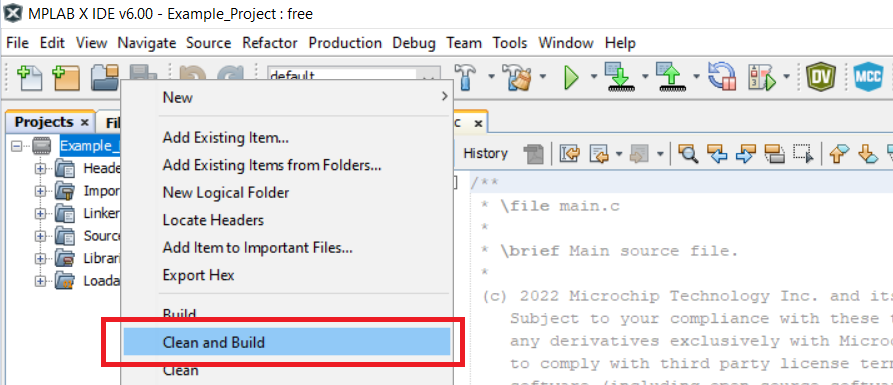

# Timer/Counter Type A (TCA) Initialized in Three Different Applications Using the AVR64DD32 Microcontroller

 The repository contains three MPLAB® X projects:

1.  [Generating a Dual Slope PWM Signal](#1-generating-a-dual-slope-pwm-signal) – Initializing the Timer/Counter type A (TCA) in Dual Slope mode to generate a 16-bit Pulse-Width Modulation (PWM) signal.
2.  [Generating Two PWM Signals in Split Mode](#2-generating-two-pwm-signals-in-split-mode) – Initializing the Timer/Counter type A (TCA) in Split mode to generate two single slope 8-bit Pulse-Width Modulation (PWM) signals.
3.  [Using Periodic Interrupt Mode](#3-using-periodic-interrupt-mode) – Initializing the Timer/Counter type A (TCA) in Single mode to work as a counter.

## Related Documentation

More details and code examples on the AVR64DD32 can be found at the following links:

- [AVR64DD32 Product Page](https://www.microchip.com/wwwproducts/en/AVR64DD32)
- [AVR64DD32 Code Examples on GitHub](https://github.com/microchip-pic-avr-examples?q=AVR64DD32)
- [AVR64DD32 Project Examples in START](https://start.atmel.com/#examples/AVR64DD32CuriosityNano)

## Software Used

- [MPLAB® X IDE](http://www.microchip.com/mplab/mplab-x-ide) v6.00 or newer
- [MPLAB® XC8](http://www.microchip.com/mplab/compilers) v2.36 or newer
- [AVR-Dx Series Device Pack](https://packs.download.microchip.com/) v2.1.152 or newer

## Hardware Used

- The AVR64DD32 Curiosity Nano Development Board is used as a test platform
   
- Saleae Logic Analyzer

## Operation

To program the Curiosity Nano board with this MPLAB® X project, follow the steps provided in the [How to Program the Curiosity Nano Board](#how-to-program-the-curiosity-nano-board) chapter.  

## 1. Generating a Dual Slope PWM Signal

This code example shows how to initialize the TCA in Dual Slope mode to generate a 16-bit PWM signal with a 1 kHz frequency and 50% duty cycle on a GPIO pin.

### 1.1 Setup

The following configurations must be made for this project:

- System clock is 4 MHz

- TCA0:
  - Clock selection: System clock/4
  - Timer mode: 16-bit (Normal)
  - 1 kHz frequency and 50% duty cycle
  - Waveform Generation mode: Dual Slope PWM, overflow on BOTTOM
  - Output on channel 0

- Logic Analyzer:
  - connected on PC0 pin

|   Pin   |   Configuration   |
| :-----: | :---------------: |
|   PC0   |   Digital output  |

### 1.2 Demo

- The PWM signal generated by the TCA0 can be seen in the following image
 

The waveform period is approximately 1 kHz and its duty cycle is 50%.

### 1.3 Summary

This code example shows how to initialize the TCA in Dual Slope mode to generate a 16-bit PWM signal with a 1 kHz frequency and 50% duty cycle.  

[Back to top](#timercounter-type-a-tca-initialized-in-three-different-applications-using-the-avr64dd32-microcontroller)

## 2. Generating Two PWM Signals in Split Mode

This code example shows how to initialize the TCA in Split mode to generate two single slope 8-bit PWM signals on two GPIO pins. The signals will be configured with different frequencies and different duty cycles, as follows:
- 1.000 kHz PWM signal with 50% duty cycle
- 3.333 kHz PWM signal with 33% duty cycle

### 2.1 Setup

The following configurations must be made for this project:

- System clock is 4 MHz

- TCA0:
  - Clock selection: System clock/16
  - Timer mode: 8-bit (Split)
  - Signal with output on PC0 has 1.000 kHz frequency and 50% duty cycle
  - Signal with output on PC3 has 3.333 kHz frequency and 33% duty cycle
  - Output on channel 0
  - Output on channel 3

- Logic Analyzer:
  - connected on PC0 and PC3

|   Pin   |  Configuration    |
| :-----: | :---------------: |
|   PC0   |   Digital output  |
|   PC3   |   Digital output  |

### 2.2 Demo

- The PWM signals generated by the TCA0 can be seen in the following image
 

The first waveform (PC0) frequency is approximately 1.000 kHz and its duty cycle is 50%. 
The second waveform (PC3) frequency is approximately 3.333 kHz and its duty cycle is 33%.

### 2.3 Summary

This code example shows how to initialize the TCA in Split mode to generate two single slope 8-bit PWM signals on two GPIO pins, with independent duty cycles and frequencies.  

[Back to top](#timercounter-type-a-tca-initialized-in-three-different-applications-using-the-avr64dd32-microcontroller)

## 3. Using Periodic Interrupt Mode

This use case shows how to initialize the TCA in Single mode to work as a counter. The counter overflows every 250 ms and triggers an interrupt, which toggles the LED pin.

### 3.1 Setup

The following configurations must be made for this project:

- System clock is 4 MHz

- Global interrupts enabled

- TCA0:
  - Clock selection: System clock/64
  - Timer mode: 16-bit (Normal)
  - Timer overflows every 250 ms
  - Enable overflow interrupt

- Logic Analyzer:
  - connected on the PF5 pin

|   Pin        |  Configuration    |
| :----------: | :---------------: |
|   PF5 (LED)  |   Digital output  |

### 3.2 Demo

- The digital value of the PF5 pin toggled by the TCA0 overflow interrupt can be seen in the following image
 

The value of the pin changes every 250 ms.

### 3.3 Summary

This code example shows how to initialize the TCA as a counter to trigger an overflow interrupt every 250 ms, toggling a GPIO pin (LED) in the Interrupt Service Routine (ISR).   

[Back to top](#timercounter-type-a-tca-initialized-in-three-different-applications-using-the-avr64dd32-microcontroller)

#

##  How to Program the Curiosity Nano Board

This chapter demonstrates how to use the MPLAB® X IDE to program an AVR® device with an Example_Project.X. This can be applied to any other projects.

1.  Connect the board to the PC.

2.  Open the Example_Project.X project in MPLAB® X IDE.

3.  Set the Example_Project.X project as main project.
     Right click the project in the **Projects** tab and click **Set as Main Project**.
     

4.  Clean and build the Example_Project.X project.
     Right click the **Example_Project.X** project and select **Clean and Build**.
     

5.  Select **AVRxxxxx Curiosity Nano** in the Connected Hardware Tool section of the project settings:
     Right click the project and click **Properties**.
     Click the arrow under the Connected Hardware Tool.
     Select **AVRxxxxx Curiosity Nano** (click the **SN**), click **Apply** and then **OK**.
     

6.  Program the project to the board.
     Right click the project and then **Make and Program Device**.
     

 

- [Back to 1. Generating a Dual Slope PWM Signal](#1-generating-a-dual-slope-pwm-signal)
- [Back to 2. Generating Two PWM Signals in Split Mode](#2-generating-two-pwm-signals-in-split-mode)
- [Back to 3. Using Periodic Interrupt Mode](#3-using-periodic-interrupt-mode)
- [Back to top](#timercounter-type-a-tca-initialized-in-three-different-applications-using-the-avr64dd32-microcontroller)
